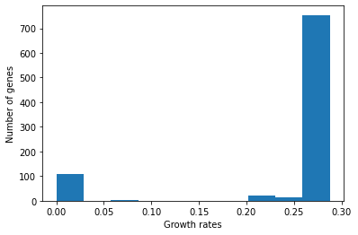

# 1. Getting Started

## Authors: 
* Arianna Basile, MRC Toxicology Unit, University of Cambridge
* Francisco Zorrilla, MRC Toxicology Unit, University of Cambridge

## Learning Outcomes

In this tutorial you will use [cobrapy](https://cobrapy.readthedocs.io/en/latest/) to learn the following:

* **1.1**: Import a metabolic reconstruction
* **1.2**: Inspect the reactions of your model
* **1.3**: Inspect the metabolites in your model
* **1.4**: Inspect the genes in your model
* **1.4.1**: Perform in-silico gene knockout experiments


```python
# Import required packages
import cobra

# Enable autocompleting with tab key
%config Completer.use_jedi = False

```

## 1.1 Import a reconstruction

The [Systems Biology Markup Language](https://sbml.org/) is an XML-based standard format for distributing models which has support for COBRA models through the FBC extension version 2.

Cobrapy has native support for reading and writing SBML with FBCv2. Please note that all id’s in the model must conform to the SBML SID requirements in order to generate a valid SBML file.

Let's download and import the model of <a href="http://bigg.ucsd.edu/search?query=Saccharomyces+cerevisiae+S288C"> Saccharomyces cerevisiae</a>.


```python
model_yeast=cobra.io.read_sbml_model("iMM904.xml.gz")
```

The reactions, metabolites, genes, and compartments attributes of the cobrapy model are a special type of `list` called a `cobra.DictList`, and each one is made up of `cobra.Reaction`, `cobra.Metabolite`, `cobra.Gene`, `cobra.Compartment` objects, respectively.


```python
print("Reactions: ",len(model_yeast.reactions))
print("Metabolites: ",len(model_yeast.metabolites))
print("Genes: ",len(model_yeast.genes))
print("Compartments: ",len(model_yeast.compartments))
```

    Reactions:  1577
    Metabolites:  1226
    Genes:  905
    Compartments:  8


When using Jupyter notebooks, this type of information is rendered as a table.


```python
model_yeast
```


<table>
    <tr>
        <td><strong>Name</strong></td>
        <td>iMM904</td>
    </tr><tr>
        <td><strong>Memory address</strong></td>
        <td>0x07ff0fba967c0</td>
    </tr><tr>
        <td><strong>Number of metabolites</strong></td>
        <td>1226</td>
    </tr><tr>
        <td><strong>Number of reactions</strong></td>
        <td>1577</td>
    </tr><tr>
        <td><strong>Number of groups</strong></td>
        <td>0</td>
    </tr><tr>
        <td><strong>Objective expression</strong></td>
        <td>1.0*BIOMASS_SC5_notrace - 1.0*BIOMASS_SC5_notrace_reverse_93090</td>
    </tr><tr>
        <td><strong>Compartments</strong></td>
        <td>cytosol, extracellular space, mitochondria, peroxisome/glyoxysome, endoplasmic reticulum, vacuole, golgi apparatus, nucleus</td>
    </tr>
  </table>


Just like a regular list, objects in the `DictList` can be retrieved by index. For example, to get the 3rd reaction in the model (at index 2nd because of 0-indexing):


```python
model_yeast.reactions[2]
```


<table>
    <tr>
        <td><strong>Reaction identifier</strong></td><td>13BGHe</td>
    </tr><tr>
        <td><strong>Name</strong></td><td>Exo 1 3 beta glucan glucohydrase</td>
    </tr><tr>
        <td><strong>Memory address</strong></td>
        <td>0x07ff10a88fa90</td>
    </tr><tr>
        <td><strong>Stoichiometry</strong></td>
        <td>
            <p style='text-align:right'>13BDglcn_e + h2o_e --> glc__D_e</p>
            <p style='text-align:right'>1 3 beta D Glucan C6H10O5 + H2O H2O --> D-Glucose</p>
        </td>
    </tr><tr>
        <td><strong>GPR</strong></td><td>YOR190W or YDR261C or YLR300W</td>
    </tr><tr>
        <td><strong>Lower bound</strong></td><td>0.0</td>
    </tr><tr>
        <td><strong>Upper bound</strong></td><td>999999.0</td>
    </tr>
</table>


Additionally, items can be retrieved by their id using the `DictList.get_by_id()` function. For example, to get the cytosolic atp metabolite object (the id is `atp_c`), we will inspect metabolites in the section 1.3
For the moment, we can focus on the reactions of our model. 

## 1.2 Reactions

We will consider the reaction glucose 6-phosphate isomerase, which interconverts glucose 6-phosphate and fructose 6-phosphate. The reaction id for this reaction in our test model is PGI. However, if you want to see the IDs of the first `N` number of reactions in the reconstruction, you can run the code below:


```python
reaction_ids = [reaction.id for reaction in model_yeast.reactions]
N=20
reaction_ids[:N]
```


    ['CITtcp',
     '13BGH',
     '13BGHe',
     '13GS',
     '16GS',
     '23CAPPD',
     '2DDA7Ptm',
     '2DHPtm',
     '2DOXG6PP',
     '2HBO',
     '2HBt2',
     '2HMHMBQMTm',
     '2HP6MPMOm',
     '2HPMBQMTm',
     '2HPMMBQMOm',
     '2MBACt',
     'EX_epistest_SC_e',
     'EX_epist_e',
     '2MBALDt',
     '2MBALDtm']


Now, let's focus on PGI or another reaction of your choice:


```python
pgi = model_yeast.reactions.get_by_id("PGI")
pgi
```


<table>
    <tr>
        <td><strong>Reaction identifier</strong></td><td>PGI</td>
    </tr><tr>
        <td><strong>Name</strong></td><td>Glucose-6-phosphate isomerase</td>
    </tr><tr>
        <td><strong>Memory address</strong></td>
        <td>0x07ff10b150fa0</td>
    </tr><tr>
        <td><strong>Stoichiometry</strong></td>
        <td>
            <p style='text-align:right'>g6p_c <=> f6p_c</p>
            <p style='text-align:right'>D-Glucose 6-phosphate <=> D-Fructose 6-phosphate</p>
        </td>
    </tr><tr>
        <td><strong>GPR</strong></td><td>YBR196C</td>
    </tr><tr>
        <td><strong>Lower bound</strong></td><td>-999999.0</td>
    </tr><tr>
        <td><strong>Upper bound</strong></td><td>999999.0</td>
    </tr>
</table>


We can view the full name and reaction catalyzed as strings.


```python
print(pgi.name)
print(pgi.reaction)
```

    Glucose-6-phosphate isomerase
    g6p_c <=> f6p_c


We can also view reaction upper and lower bounds, large numbers, typically around 1000 or more, are used as infinite limits (unconstained fluxes). 
Because the `pgi.lower_bound` < 0, and `pgi.upper_bound` > 0, pgi is reversible.


```python
print(pgi.lower_bound, "< pgi <", pgi.upper_bound)
print(pgi.reversibility)
```

    -999999.0 < pgi < 999999.0
    True


The lower and upper bound of reactions can also be modified, and the reversibility attribute will automatically be updated. The preferred method for manipulating bounds is using reaction.bounds, e.g.


```python
# Save original bounds
old_bounds = pgi.bounds

# Define and print new bounds
pgi.bounds = (0, 1000.0)
print("New bounds: ",pgi.lower_bound, "< pgi <", pgi.upper_bound)
print("Reversibility after modification:", pgi.reversibility)

# Reset bounds and show reversibility
pgi.bounds = old_bounds
print("Reversibility after resetting:", pgi.reversibility)
```

    New bounds:  0 < pgi < 1000.0
    Reversibility after modification: False
    Reversibility after resetting: True


We can also ensure the reaction is mass balanced. This function will return elements which violate mass balance. If it comes back empty, then the reaction is mass balanced.


```python
pgi.check_mass_balance()
```


    {}


In order to add a metabolite, we pass in a dictionary with the metabolite object and its coefficient


```python
pgi.add_metabolites({model_yeast.metabolites.get_by_id("h_c"): -1})
pgi.reaction
```


    'g6p_c + h_c <=> f6p_c'


The reaction is no longer mass balanced


```python
pgi.check_mass_balance()
```


    {'charge': -1.0, 'H': -1.0}


We can remove the metabolite, and the reaction will be balanced once again.


```python
pgi.subtract_metabolites({model_yeast.metabolites.get_by_id("h_c"): -1})
print(pgi.reaction)
print(pgi.check_mass_balance())
```

    g6p_c <=> f6p_c
    {}


## 1.3 Metabolites

We will consider cytosolic atp as our metabolite, which has the id `atp_c` in our test model. However, if you want to see the IDs of the frist N metabolites in the reconstruction, you can run the code below:


```python
metabolite_ids = [metabolite.id for metabolite in model_yeast.metabolites]
N=20
metabolite_ids[:N]
```


    ['2dr5p_c',
     '2hb_c',
     '2hb_e',
     '2hhxdal_c',
     '2hp6mbq_m',
     '2hp6mp_m',
     '2hpmhmbq_m',
     '2hpmmbq_m',
     '2ippm_c',
     '2kmb_c',
     '2mahmp_c',
     '2mbac_c',
     '2mbac_e',
     '2mbald_c',
     '2mbald_e',
     '2mbald_m',
     '2mbtoh_c',
     '2mbtoh_e',
     '2mbtoh_m',
     '2mcit_m']


Now, let's focus on `atp_c` or another metabolite of your choice:


```python
atp = model_yeast.metabolites.get_by_id("atp_c")
atp
```


<table>
    <tr>
        <td><strong>Metabolite identifier</strong></td><td>atp_c</td>
    </tr><tr>
        <td><strong>Name</strong></td><td>ATP C10H12N5O13P3</td>
    </tr><tr>
        <td><strong>Memory address</strong></td>
        <td>0x07ff10a4e71c0</td>
    </tr><tr>
        <td><strong>Formula</strong></td><td>C10H12N5O13P3</td>
    </tr><tr>
        <td><strong>Compartment</strong></td><td>c</td>
    </tr><tr>
        <td><strong>In 149 reaction(s)</strong></td><td>
            FMNAT, GLYTRS, DTMPK, ADK1, FACOAL180, ETHAK, RNTR1, FACOAL182, NDPK4, INSK, CYSTRS, FACOAL140, NDPK2, GLNS, AASAD1, PRAGSr, PROTRS, ACCOAC, PRPPS, NDPK9, HEX1, MEVK1, HETZK, TMPK, PRFGS, NDPK8,...</td>
    </tr>
</table>


We can print out the metabolite name and compartment (cytosol in this case) directly as string.


```python
print(atp.name)
print(atp.compartment)
```

    ATP C10H12N5O13P3
    c


We can see that ATP is a charged molecule in our model.


```python
atp.charge
```


    -4


We can see the chemical formula for the metabolite as well.


```python
print(atp.formula)
```

    C10H12N5O13P3


## 1.4 Genes

The `gene_reaction_rule` is a boolean representation of the gene requirements for this reaction to be active as described in <a href="https://www.nature.com/articles/nprot.2011.308">Schellenberger et al 2011 Nature Protocols 6(9):1290-307</a>.

The gene-protein-reaction rules (GPR) are stored as `GPR class` in the GPR field of a reaction object. A string representation can be extracted using `gene_reaction_rule` on a Reaction object.


```python
gpr_string = pgi.gene_reaction_rule
print(gpr_string)
```

    YBR196C


Corresponding gene objects also exist. These objects are tracked by the reactions itself, as well as by the model


```python
pgi_gene = model_yeast.genes.get_by_id("YBR196C")
pgi_gene
```


<table>
    <tr>
        <td><strong>Gene identifier</strong></td><td>YBR196C</td>
    </tr><tr>
        <td><strong>Name</strong></td><td>PGI1</td>
    </tr><tr>
        <td><strong>Memory address</strong></td>
        <td>0x07ff10a7dcf10</td>
    </tr><tr>
        <td><strong>Functional</strong></td><td>True</td>
    </tr><tr>
        <td><strong>In 3 reaction(s)</strong></td><td>
            PGI, G6PI, G6PI3</td>
    </tr>
</table>


To check that this gene is also on KEGG database to assess the consistency of the metabolic reconstruction, click <a href="https://www.genome.jp/entry/sce:YBR196C"> here</a>. 

### 1.4.1 Simulating Knockouts

The `delete_model_genes` function will evaluate the GPR and set the upper and lower bounds to 0 if the reaction is knocked out.


```python
model_yeast=cobra.io.read_sbml_model("iMM904.xml.gz")
pgi=model_yeast.reactions.get_by_id("PGI")
print("before KO: %4d < flux_PGI < %4d" % (pgi.lower_bound, pgi.upper_bound))


gene=model_yeast.genes.get_by_id("YBR196C")
gene.knock_out()
print("after KO: %4d < flux_PGI < %4d" % (pgi.lower_bound, pgi.upper_bound))

```

    before KO: -999999 < flux_PGI < 999999
    after KO:    0 < flux_PGI <    0


One may often want to make small changes to a model and evaluate their impacts. For example, we may want to knock-out all reactions sequentially, and see what the impact of this is on the objective function. One way of doing this would be to create a new copy of the model before each knock-out with the `model.copy()` function. However, even with small models, this is a very slow approach as models are quite complex objects. Instead, it is better to carry out the knock-out, optimize (i.e. solve FBA problem), and then manually reset the reaction bounds before proceeding with the next reaction. Since this is such a common scenario, `cobrapy` allows us to use the model as a context, to have changes reverted automatically.

Here we knock out the first N reactions and check for new growth rate values:


```python
# Import the model again to reverse the previous edits
model_yeast=cobra.io.read_sbml_model("iMM904.xml.gz")

# Show FBA solution growth rate prior to reaction knockouts
model_yeast.optimize()
print("Pre reaction knockout growth rate: ",model_yeast.objective.value)

# Define first N number of reactions to knock out
N=20

# Simulate knockouts of N single reactions 
for reaction in model_yeast.reactions[:N]:
    with model_yeast as model_yeast:  # Prevent editing of the original model
        reaction.knock_out()
        model_yeast.optimize()
        print('%s blocked (bounds: %s), new growth rate %f' %
              (reaction.id, str(reaction.bounds), model_yeast.objective.value))
```

    Pre reaction knockout growth rate:  0.28786570370401793
    CITtcp blocked (bounds: (0, 0)), new growth rate 0.287866
    13BGH blocked (bounds: (0, 0)), new growth rate 0.287866
    13BGHe blocked (bounds: (0, 0)), new growth rate 0.287866
    13GS blocked (bounds: (0, 0)), new growth rate 0.000000
    16GS blocked (bounds: (0, 0)), new growth rate 0.287866
    23CAPPD blocked (bounds: (0, 0)), new growth rate 0.287866
    2DDA7Ptm blocked (bounds: (0, 0)), new growth rate 0.287866
    2DHPtm blocked (bounds: (0, 0)), new growth rate 0.287866
    2DOXG6PP blocked (bounds: (0, 0)), new growth rate 0.287866
    2HBO blocked (bounds: (0, 0)), new growth rate 0.287866
    2HBt2 blocked (bounds: (0, 0)), new growth rate 0.287866
    2HMHMBQMTm blocked (bounds: (0, 0)), new growth rate 0.287866
    2HP6MPMOm blocked (bounds: (0, 0)), new growth rate 0.287866
    2HPMBQMTm blocked (bounds: (0, 0)), new growth rate 0.287866
    2HPMMBQMOm blocked (bounds: (0, 0)), new growth rate 0.287866
    2MBACt blocked (bounds: (0, 0)), new growth rate 0.287866
    EX_epistest_SC_e blocked (bounds: (0, 0)), new growth rate 0.287866
    EX_epist_e blocked (bounds: (0, 0)), new growth rate 0.287866
    2MBALDt blocked (bounds: (0, 0)), new growth rate 0.287866
    2MBALDtm blocked (bounds: (0, 0)), new growth rate 0.287866


Next we will knock out genes instead of reactions.


```python
# Import the model again to reverse the previous edits
model_yeast=cobra.io.read_sbml_model("iMM904.xml.gz")

# Show FBA solution growth rate prior to gene knockouts
model_yeast.optimize()
print("Pre gene knockout growth rate: ",model_yeast.objective.value)

# Define first N number of genes to knock out
N=20

# Simulate knockouts of N genes and print values
for gene in model_yeast.genes[:N]:
    with model_yeast as model_yeast:  # Prevent editing the original model
        gene.knock_out()
        model_yeast.optimize()
        print('%s, new growth rate %f' %
              (gene.id, model_yeast.objective.value))
        

# Simulate gene knockouts for all genes, this time we are storing the results in a vector for plotting
genes_ids=[gene.id for gene in model_yeast.genes]
grow_rates=[]
for gene in model_yeast.genes:
    with model_yeast as model_yeast:  # Prevent editing the original model
        gene.knock_out()
        model_yeast.optimize()
        grow_rates.append(model_yeast.objective.value)
```

    Pre gene knockout growth rate:  0.28786570370401793
    YHR104W, new growth rate 0.287866
    YDR368W, new growth rate 0.287866
    YGR282C, new growth rate 0.287866
    YOL086C, new growth rate 0.287866
    YLR300W, new growth rate 0.287866
    YFR055W, new growth rate 0.287866
    YGL184C, new growth rate 0.287866
    YDR261C, new growth rate 0.287866
    YDL168W, new growth rate 0.287866
    YOR190W, new growth rate 0.287866
    YOL030W, new growth rate 0.287866
    YLR343W, new growth rate 0.287866
    YNL247W, new growth rate 0.287866
    YMR303C, new growth rate 0.287866
    YGR155W, new growth rate 0.287843
    YGR032W, new growth rate 0.287866
    YOL132W, new growth rate 0.287866
    YGL256W, new growth rate 0.287866
    YBR145W, new growth rate 0.287866
    YCR034W, new growth rate -0.000000


Let's see the distribution of our results creating a plot with the vectors obtained above:


```python
import matplotlib.pyplot as plt
import numpy as np

x = np.array(genes_ids)
y = np.array(grow_rates)

plt.hist(y)
plt.xlabel('Growth rates')
plt.ylabel('Number of genes')
#plt.show()
plt.savefig("distribution.png", dpi=100, bbox_inches='tight',pad_inches=0)
```


    

    


### Questions

1. Why does the distribution of predicted growth rates appear to be bimodal? 
2. Can you verify the consistency between gene and reactions knockouts results using a gene or a reaction of your choice?
3. Can you verify the essentiality of your gene of choice from the previous excercise using relevant databases (e.g. KEGG and the SGD)?
4. Do you expect these results to change if we change the medium where we are growing our yeast model? 

### Solution to question 2


```python
#type your code here, results in the html
```


```python
#type your code here, results in the html
```

### Solution to question 3
When we look for YJL167W in the Saccharomyces genome database --> <a href="https://www.yeastgenome.org/locus/S000003703"> HERE </a>, we find out that YJL167W is an essential gene

### Solution to question 4
Yes, we will look into this phenomenon in the next notebook.
